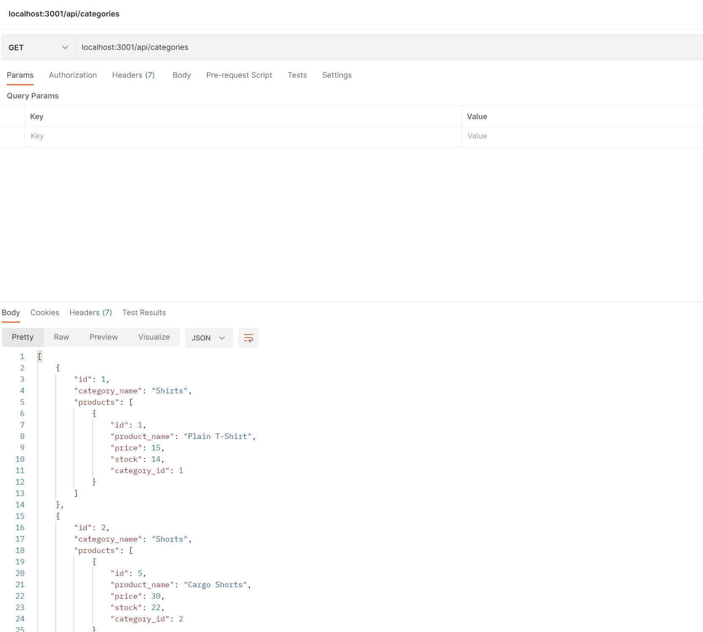

# connection-e-commerce

## Description

- My motivation for creating this project was to utilise my understanding of Object-relational mapping to build an e-commerce backend that could be utilised to create, update and delete data from an e-commerce database.
- I built this project to create a back-end e-commerce management system that woould be utilised in a business for database management.
- It allows a business to have greater interaction with their inventory system.
- I learn't that the relationships between the database

## Installation

To install my application you can use the github repo below to clone the repo, however, the server database will have to be run locally using your own server credentials to access the databse created using the schema.sql file.

You will also require the related NPM packages in the package json file to run the app correctly. 

## Usage

Below is a link to a video with the App's full usage

https://drive.google.com/file/d/15heqTVgMiERGLNpjsP_bOz7KOnIMgs2M/view

https://watch.screencastify.com/v/0YFzmolebVXOuNkqNRi6

Below is a screenshot to Postman's API workspace; with a GET request to the local server.

---

🏆 

## Badges

